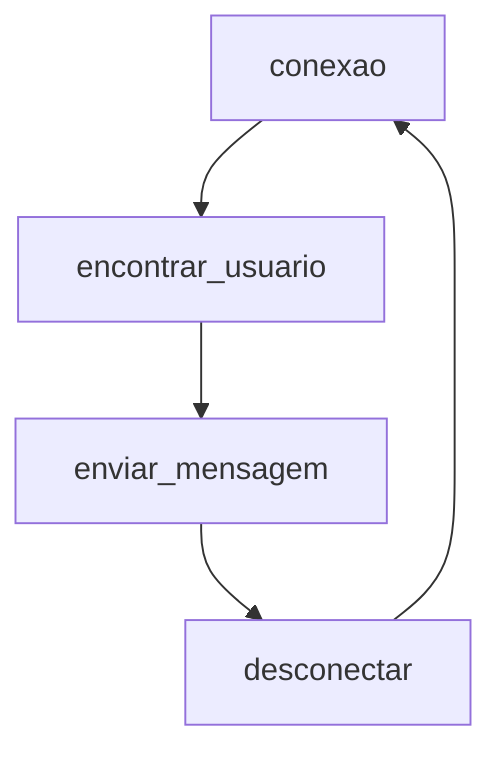

<h1 align="center">
<br>AllWhatsPy - AWP
</h1>


 
<h1 align="center">


</h1>

> PT-BR 

>Criado por Lucas Lourenço.

>Manutenido por Lucas Lourenço.


## Sumário

- [Tutorial](https://github.com/LucasLourencoo/AllWhatsPy/edit/main/README.md#tutorial-em-v%C3%ADdeo)
- [AllWhatsPy](https://github.com/LucasLourencoo/AllWhatsPy/edit/main/README.md#por-que-allwhatspy)
- [Instalação](https://github.com/LucasLourencoo/AllWhatsPy/edit/main/README.md#come%C3%A7ando-no-allwhatspy)
- [Lista de Tarefa](https://github.com/LucasLourencoo/AllWhatsPy/edit/main/README.md#objetivos-a-serem-terminados)
- [Códigos](https://github.com/LucasLourencoo/AllWhatsPy/edit/main/README.md#o-que-voc%C3%AA-pode-fazer-com-allwhatspy)
- [Notas do Criador](https://github.com/LucasLourencoo/AllWhatsPy/edit/main/README.md#notas-do-criador)
- [Autor](https://github.com/LucasLourencoo/AllWhatsPy/edit/main/README.md#autor)
- [Contribuição](https://github.com/LucasLourencoo/AllWhatsPy/edit/main/README.md#contribui%C3%A7%C3%A3o)
- [Erros](https://github.com/LucasLourencoo/AllWhatsPy/edit/main/README.md#problemas-com-o-allwhatspy)


## Tutorial em Vídeo

<h1 align="center">
 
<a href="http://linkedin.com/in/lucas-lourenco0312">

</a>

</h1>


## Avalie o Código!
É de muitíssima importância a `Star` que você pode estar dando para colaborar com a `Manutenção` e `Atualização` do código!
Se você utiliza o AllWhatsPy com frequência, gosta da forma que foi desenvolvido, se inspira nele, serei muito grato por sua avaliação!


Após tendo feito isso, vamos ao que importa: `AllWhatsPy`


## Por que AllWhatsPy?
Como já sabemos, o Whatsapp é uma ferramenta que não podemos mais viver sem.
Seja para cunho profissional ou pessoal, é necessário o manuseio completo desta aplicação.

Então... por que não torná-lo <b>`ainda mais eficiente`?</b>

Depois de ter pensado nisso, comecei a pesquisar sobre Bots e APIs do Whatsapp, me inspirei em códigos como o do [PyWhatsapp](https://github.com/shauryauppal/PyWhatsapp) e [PyWhatKit](https://github.com/Ankit404butfound/PyWhatKit) para a realização deste.

Após passar um tempo estudando e alternando entre o trabalho e o software, botei a mão na massa e comecei a minha jornada indo atrás da melhoria e da qualidade de Software. Continuo atualizando e desenvolvendo, fazendo isso  único e exclusivamente sozinho.

Foram usadas mais de [11 mil linhas de logs](https://github.com/LucasLourencoo/AllWhatsPy/edit/main/README.md#-2) para o total funcionamento do código.

Com o AllWhatsPy, você consegue fazer [o que quiser!](https://github.com/LucasLourencoo/AllWhatsPy#o-que-voc%C3%AA-pode-fazer-com-allwhatspy)


  
  
## Começando no AllWhatsPy

###Instalação


### Lógica:




## Objetivos a Serem Terminados 

- [x] Criar alternativas para envio de mensagem (Realizado - 19/12/2022)
- [x] Tratar as `except Exception` (Realizado - 21/12/2022)
- [x] Resolver bug na urllib (Realizado - 21/12/2022)
- [x] Alimentar o código com opções alternativas para `awp.conexao()` e  `awp.desconectar()` (Realizado - 21/12/2022)
- [x] Corrigir excepts de `NoSuchElementException`  (Realizado - 22/12/2022)
- [x] Implementar WebDriverWait para melhor responsividade do software (Realizado - 27/12/2022)
- [x] Configurar a entrada de `logs` (Realizado - 28/12/2022)
- [x] Atualizar ActionChains (Realizado - 15/01/2023)
- [x] Terminar `ultimas_mensagens_conversa()` (Realizado - 18/01/2023)
- [x] Explicar todas as fórmulas (Realizado - 21/01/2023)
- [x] Aperfeiçoar a função de `agendamento` (Realizado - 21/01/2023)
- [ ] Fazer vídeo e postar no Youtube de explicação para utilizar o código
- [ ] Realizar a explicação de como começar no AWP
- [ ] Criar um `pip install` para AWP
- [ ] Performar criação de pastas com a lib `pathlib` para melhor qualidade de software
- [ ] Corrigir bug na função `pegar_foto_contato()`
- [ ] Terminar função `buscar_contatos_não_lidos`


  
## O que você pode fazer com AllWhatsPy


- ##  Conectar

> É de enorme importância a utilização deste código! Afinal, ele é o responsável pela integração do AllWhatsPy ao Whatsapp.
> É possível utilizar como `awp.conexao()` ou `awp.conexao(2)`. No primeiro caso, abrirá um `popup` na tela esperando a confirmação para dar continuidade.
>  No segundo caso, será ignorado o popup que aparece após a inicialização do algoritmo.

<p>
  
```python
import AllWhatsPy as awp
awp.conexao()
```
</p>


- ## Desconectar

> Após a conclusão de todas as funções que forem usadas por você, caso seja de sua vontade desconectar o Whatsapp, rode este código. Caso contrário, o seu login ficará > sempre registrado como ainda conectar, por mais que feche a janela.
> É possível utilizar como `awp.desconectar()` ou `awp.desconectar(2)`. Caso utilize-se o primeiro caso, o software encerrará e fechará a janela. No segundo caso, irá manter a janela do QR Code aberta.

<p>
  
  ```python
import AllWhatsPy as awp
awp.conexao()
awp.desconetar()
```  
</p>

- ## Trabalhando com Chats/Contatos/Usuários

  - ### encontrar_contato(contato)
  <p>
  
    > Com esta função, iremos abrir conversas para prosseguirmos com os demais códigos. Buscará pelo nome ou pelo número, contanto que o mesmo já esteja salvo.
    

  ```python
  import AllWhatsPy as awp
    
  awp.conexao()
  awp.encontrar_contato('Lucas Lourenço')
   
  awp.desconectar()
  ```

  </p>

  - ### encontrar_usuario(numero)
  <p>
  
    > Já com esta função, nós não conseguimos buscar pelo nome, mas somente pelo número. Entretando, você NÃO precisa estar com o número salvo. 
  Pode ser viável para o envio de mensagem para planilhas de números e afins.
    

  ```python
  import AllWhatsPy as awp
    
  awp.conexao()
  awp.encontrar_usuario('21900000000')
   
  awp.desconectar()
  ```

  
  </p>

  - ### encontrar_primeira_conversa(ignorar_fixado = True)
  <p>
  
    > Essa função será responsável por abrir a primeira conversa do seu Whatsapp.
  Caso "ignorar_fixado" for True, ele irá verificar se há uma conversa fixada e pular a mesma.
  Se o valor de "ignorar_fixado" for False, irá selecionar o primeiro comentário fixado.
    

  ```python
  import AllWhatsPy as awp
    
  awp.conexao()
  awp.encontrar_primeira_conversa()
   
  awp.desconectar()
  ```

  
  </p>
  
  
  - ### descer_conversa_origem_atual(quantidade: int = 1)
  <p>
  
    > Essa função irá descer a conversa atual que estiver aberta.
    Como argumento, é possível indicar quantas você quer descer. Já é 1 por padrão. 
    

  ```python
  import AllWhatsPy as awp
    
  awp.conexao()
  awp.encontrar_contato('Lucas Lourenço')
  awp.descer_conversa_origem_atual()
   
  awp.desconectar()
  ```

  </p>  
  
  
  - ### subir_conversa_origem_atual(quantidade: int = 1)
  <p>
  
    > Essa função irá subir a conversa atual que estiver aberta.
    Como argumento, é possível indicar quantas você quer subir. Já é 1 por padrão. 
    

  ```python
  import AllWhatsPy as awp
    
  awp.conexao()
  awp.encontrar_contato('Lucas Lourenço')
  awp.subir_conversa_origem_atual()
   
  awp.desconectar()
  ```

  </p> 


  - ### descer_chat_quantidade(quantidade: int)
  <p>
  
    > Essa função irá desce a conversa atual que estiver aberta de acordo com a quantidade declarada.
     

  ```python
  import AllWhatsPy as awp
    
  awp.conexao()
  awp.descer_chat_quantidade()
   
  awp.desconectar()
  ```

  </p> 


  - ### sair_da_conversa()
  <p>
  
    > Função responsável por sair da conversa atualmente aberta.
     

  ```python
  import AllWhatsPy as awp
    
  awp.conexao()
  awp.encontrar_usuario(21900000000)
  awp.enviar_mensagem()
  awp.sair_da_conversa()
  
  ```

  </p> 


  - ### aplicar_filtro()
  <p>
  
    > Função responsável por aplicar o filtro, aparecendo somente as mensagens que não foram lidas.
     

  ```python
  import AllWhatsPy as awp
    
  awp.conexao()
  awp.aplicar_filtro()
   
  awp.desconectar()
  ```

  </p> 


  - ### pegar_dados_contato()
  <p>
  
    > Esta função retornará uma lista contendo o nome e o número do contato que está aberto.
    Sendo o índice 0 o nome e o índice 1 o número
     

  ```python
  import AllWhatsPy as awp
    
  awp.conexao()
  dados = awp.pegar_dados_contato()
  
  ```

  </p>


  - ### apagar_conversa()
  <p>
  
    > Através desta função, a conversa atualmente aberta será excluida.
     

  ```python
  import AllWhatsPy as awp
    
  awp.conexao()
  awp.encontrar_contato('Lucas Lourenço')
  awp.apagar_conversa()
  
  awp.desconectar()
  
  ```

  </p>
  
  
  - ### arquivar_conversa()
  <p>
  
    > Através desta função, a conversa atualmente aberta será arquivada.
     

  ```python
  import AllWhatsPy as awp
    
  awp.conexao()
  awp.encontrar_contato('Lucas Lourenço')
  awp.arquivar_conversa()
  
  awp.desconectar()
  
  ```

  </p>
  
  
  - ### marcar_como_nao_lida()
  <p>
  
    > Através desta função, a conversa atualmente aberta será marcada como não lida.
     

  ```python
  import AllWhatsPy as awp
    
  awp.conexao()
  awp.encontrar_contato('Lucas Lourenço')
  awp.marcar_como_nao_lida()
  
  awp.desconectar()
  
  ```

  </p>
  
  
  
  
  
  
- ## Enviando Mensagens

  - ### enviar_mensagem(mensagem)
  <p>
  
  > Função responsável pelo envio de mensagens. Esta função em específico irá enviar, dependendo do dado inserido, uma mensagem atrás da outra. Isto é: Caso você         insira uma lista contendo todos as mensagens que você quer que envie, ela assim fará. Entretando, cada item desta lista será uma mensagem diferente. Caso você insira   números e strings, ela também entenderá. É a mais usada das 4 funções de envio de mensagem, por ser mais simples de manusear.
  
  
  ```python
  import AllWhatsPy as awp

  awp.conexao()
  awp.encontrar_contato('Lucas Lourenço')
  awp.enviar_mensagem('Hello World!')

  awp.desconectar()
  
  ```

  </p>


  - ### enviar_mensagem_paragrafada(mensagem)
  <p>

  > Ao contrário da "enviar_mensagem()", esta não irá enviar uma atrás da outra. Caso a string contenha mais de uma linha, a função irá analisar e 
  irá alocar tudo à uma única linha, sendo assim, não enviando várias mensagens uma atrás da outra, mas sim uma única.
  
  
  ```python
  import AllWhatsPy as awp

  awp.conexao()
  awp.encontrar_contato('Lucas Lourenço')
  awp.enviar_mensagem_paragrafada(
  '''
  Olá!
  Meu nome é Lucas Lourenco.
  Sou o Criador do AWP.
  '''
  )

  awp.desconectar()
  ```

  </p>


  - ### enviar_mensagem_por_link(numero, mensagem)
    <p>
  
  > Esta função irá pegar uma funcionalidade do Whatsapp e irá fazer com que se envie através dela! 
    Não há a necessidade de usar o "encontrar_usuario()" ou "encontrar_contato()"
    OBS.: Não use esta função para enviar para muitas pessoas, senão poderá bloquear seu número. 

  
    ```python
  import AllWhatsPy as awp

  awp.conexao()
  awp.enviar_mensagem_por_link(21900000000 ,'E ai, tudo bem?')

  awp.desconectar()

    ```

    </p>


   - ### enviar_mensagem_direta(contato, mensagem, selecionar_funcao, salvo):

  <p>
  
  > Ela fará com que todo o processo que teria que ser feito com as outras functions não seja necessário. Tudo será feito por esta única.
  
  >contato = O destino da mensagem, seja ela número ou nome.
  
  >mensagem = A mensagem que será enviada ao contato.
  
  >selecionar_função = Entre 1 e 2, serão as funções enviar_mensagem(), enviar_mensagem_paragrafada() respectivamente.
  
  >salvo = Se for True, o contato deverá estar salvo, portanto, o argumemento contato deve ser um número que já está salvo no seu Whatsapp.
  >Caso contrário, se for False, usará o método por link, o qual deverá ser um número no argumento Contato
  
  Para número salvo:
  
    ```python
  
  import AllWhatsPy as awp

  awp.conexao()
  awp.enviar_mensagem_direta('Lucas Lourenco','Olá! Tudo bem?',1 ,True)

  awp.desconectar()
    ```

 
    
  Para número não salvo:
  
  ```python

  import AllWhatsPy as awp

  awp.conexao()
  awp.enviar_mensagem_direta(21900000000,'Olá! Tudo bem?',1 ,False)

  awp.desconectar()
  ```

  </p>
  
  
  
- ## Voltar ao último contato que parou
<p>
  
  > Primeiro, use o código a seguir para registrá-lo. 
  (Mesmo se a máquina for desligada, ainda está salvo. Basta rodar o código abaixo)
  
```python
import AllWhatsPy as awp
  
awp.conexao()
awp.contato_registrar()
  
awp.desconectar()
```
 > Após já ter registrado, use o seguinte para voltar ao contato.
  Existem 2 opções. Se o valor declarado for 1, ele buscará pelo nome do contato. Caso o valor declarado for 2, ele buscará pelo número.
  
```python
import AllWhatsPy as awp
  
awp.conexao()
awp.contato_abrir_registrado(2)
  
awp.desconectar()
```
</p>


- ## Agendamento
<p>
  
> O código irá aguardar até a chegada da hora planejada. Feito isso, irá liberar para que o restante do código siga adiante.

`awp.agendamento(dia_programado, hora_programado, minuto_programado)`

```python
import AllWhatsPy as awp
  
awp.conexao()
awp.agendamento('20', '08', '30')
awp.encontrar_contato('Lucas Lourenço')
awp.enviar_mensagem('Hello World')
  
awp.desconectar()
```
</p>

- ## Enviando Arquivos, Vídeos e Imagens

  - ### enviar_imagem(nome_imagem)
    <p>

    > Esta função é responsável pelo envio de imagens.
    A imagem tem que estar na mesma pasta que o módulo principal ou passar o caminho dela.


    ```python
    import AllWhatsPy as awp

    awp.conexao()
    awp.encontrar_contato('Lucas Lourenço')
    awp.enviar_imagem('AlgumaImagem.png')

    awp.desconectar()
    ```

    </p>


  - ### enviar_video(nome_video)
    <p>

    > Esta função é responsável pelo envio de vídeos.
    O vídeo tem que estar na mesma pasta que o módulo principal ou passar o caminho dela.
    
    > A função analisará se o arquivo é menor do que a capacidade máxima de tamanho de vídeo para envio no whatsapp.


    ```python
    import AllWhatsPy as awp

    awp.conexao()
    awp.encontrar_contato('Lucas Lourenço')
    awp.enviar_video('nome_video.mp4')

    awp.desconectar()
    ```

    </p>


  - ### enviar_arquivo(nome_arquivo)
    <p>

    > Esta função é responsável pelo envio de arquivo.
    O arquivo tem que estar na mesma pasta que o módulo principal ou passar o caminho dela.
    

    ```python
    import AllWhatsPy as awp

    awp.conexao()
    awp.encontrar_contato('Lucas Lourenço')
    awp.enviar_arquivo('nome_arquivo.ext')

    awp.desconectar()
    ```

    </p>


- ## Listando as Ultimas Mensagens e Contatos Aparentes
  
  - ### lista_ultimas_mensagens_recebidas_de_contatos(quantidade: int = 1)
    <p>
    
    > Função responsável para encontrar as últimas mensagens enviadas por cada contato
     de acordo com a quantidade oferecida na aplicação da função.
    Por padrão, a quantidade é 1, mas basta alterar a mesma que retornará quantas conversas forem pré-determinadas.
    Esta função retornará um dicionário contendo 2 dados, sendo eles:
    
    >1- Key - Nome do contato
    
    >2- Values: tupla - No índice 0 será a hora que a última mensagem foi enviada e no índice 1 será a última mensagem
    
    
    ```python
    import AllWhatsPy as awp

    awp.conexao()
    dados = awp.lista_ultimas_mensagens_recebidas_de_contatos()

    ```
    
    </p>


- ## Mensagens de Conversas
  
  - ### ultimas_mensagens_conversa()
    <p>
    
    > Esta função irá, na conversa atualmente aberta, pegar as mensagens que foram enviadas.0                                                                                                                                                                                                                                                                                                                                                                                                                                                                 
     Em seu início, ela subirá para ser possível de captar mais inforamções e, logo após, irá retornar tudo em um dicionário separado por índices. E os valores desses      índices serão mais um dicionário contendo todas as informações daquela conversa.
    
    ```python
    import AllWhatsPy as awp

    awp.conexao()
    awp.encontrar_contato('Lucas Lourenço')
    dados = awp.ultimas_mensagens_conversa()
    ```
     
    `output:`
    ```python
    >>> {0 : {'[09:30, 21/01/2023] Lucas Lourenço: ': 'Me encaminha oq ela disse kkkkk'}, 
    >>> 1 : {'[09:32, 21/01/2023] Jenyfer: ': ['Me encaminha oq ela disse kkkkk','taaa']},
    >>> 2 : {'[09:32, 21/01/2023] Jenyfer: ': 'você vai adorar kkkkkk'}}
 
    ```
    Como é possível reparar, será trazido informações com o índice. Os `values` deles serão outra dicionário onde você pode estar trabalhando. 
    > quando a mensagem for citando uma outra mensagem enviada pela pessoa que está conversando, o `value` desse dicionário será uma lista
  
    </p>


## Acesso ao Código
Se quiser ter acesso ao código, basta [Clicar Aqui](AllWhatsPy.py)


## Notas do Criador

Para a criação deste código, foram usadas 11 mil linhas de log
<h1 align="center">

</h1>

Sem dúvidas, a função mais difícil foi a ultimas_mensagens_conversa()
cxriei essa parte para explicar algumas coisas e falar do meu ponto de vista a criação do código


## Autor

<h2>
<p>

[Linkedin](http://linkedin.com/in/lucas-lourenco0312)

</p>


<p>

[Instagram](https://www.instagram.com/lucaslourencoo__/)


</p>
 
<p>
  
[Email](Lucas.lcl100@gmail.com)
  
</p>
</h2>


## Problemas com o AllWhatsPy
Ainda não foi encontrado problemas no código. 

Caso você tenha percebido algo, sinta-se à vontade para descrevê-lo na aba `Issues`!

E também para você que está tendo dificuldades em trabalhar com esta lib, basta descrevê-lo que irei ajudá-lo!


## Contribuição

Pull Requests são muito bem vindas!

Caso seja uma grande mudança, por favor, abra uma discussão na aba `Issues` para maior compreensão do seu caso.
