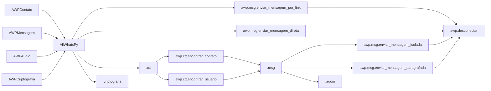

<h1 align="center">
<br>AllWhatsPy - AWP
</h1>

 
<h1 align="center">


<div align="center">
    
   
 
  
   
   
   
</div>
</h1>

> PT-BR

>Criado por [Lucas Lourenço](https://github.com/DevLucasLourenco/AllWhatsPy#autor)

>Manutenido por [Lucas Lourenço](https://github.com/DevLucasLourenco/AllWhatsPy#autor)

>Pipy: [https://pypi.org/project/allwhatspy-awp](https://pypi.org/project/allwhatspy-awp)

>v2.1.2


## Sumário

- [Tutorial](https://github.com/DevLucasLourenco/AllWhatsPy/tree/main/README.md#tutorial-em-v%C3%ADdeo)
- [Autor](https://github.com/DevLucasLourenco/AllWhatsPy/tree/main/README.md#autor)
- [AllWhatsPy](https://github.com/DevLucasLourenco/AllWhatsPy/tree/main/README.md#por-que-allwhatspy)
- [Instalação](https://github.com/DevLucasLourenco/AllWhatsPy/tree/main/README.md#------instala%C3%A7%C3%A3o---)
- [Lista de Tarefa](https://github.com/DevLucasLourenco/AllWhatsPy/tree/main/README.md#objetivos-a-serem-terminados)
- [Exemplos](https://github.com/DevLucasLourenco/AllWhatsPy/tree/main/README.md#exemplos)
- [Códigos](https://github.com/DevLucasLourenco/AllWhatsPy/tree/main/README.md#utilizando-allwhatspy)
- [Erros](https://github.com/DevLucasLourenco/AllWhatsPy/tree/main/README.md#erros)


## Tutorial em Vídeo

<h1 align="center">
 
<a href="https://www.youtube.com/watch?v=5_jpKMmHdso&list=PLDEkcBIFEDjnjAuoyVOa0rkn8sdowuLCn&index=1&ab_channel=LucasLourenco">

</a>

</h1>


### 🚨Vídeo mais recente🚨 👇🏻

<h1 align="center">

<a href="https://youtu.be/5_jpKMmHdso">

</a>

</h1>


## ⭐ Avalie o Código! ⭐


É de muitíssima importância a `Estrela` que você pode estar dando para colaborar com a `Manutenção` e `Atualização` do código!
Se você utiliza o AllWhatsPy com frequência, gosta da forma que foi desenvolvido, se inspira nele, serei muito grato por sua avaliação!

<h1 align="center">
<a href="https://github.com/DevLucasLourenco/AllWhatsPy/stargazers">

</a>
</h1>


## Autor

<h2>
<p>

Linkedin: [devlucaslourenco](https://www.linkedin.com/in/devlucaslourenco/)

</p>


<p>

Instagram: [lucaslourencoo__](https://www.instagram.com/lucaslourencoo__/)


</p>
 
<p>
  
Email: dev.lucaslourenco@gmail.com
  
</p>
</h2>


## Por que AllWhatsPy?

À medida que nossa dependência do WhatsApp, seja para fins profissionais ou pessoais, se torna incontestável, surge a inquietação de como otimizar essa aplicação essencial em nossas vidas. A resposta a essa inquietação se materializa na forma do AllWhatsPy, uma biblioteca inovadora e poderosa criada para revolucionar sua experiência de automação de processos no WhatsApp.

Inspirado por notáveis projetos como o [PyWhatsapp](https://github.com/shauryauppal/PyWhatsapp) e o [PyWhatKit](https://github.com/Ankit404butfound/PyWhatKit), iniciei uma jornada de exploração, imersão e pesquisa aprofundada nas possibilidades oferecidas por Bots e APIs do WhatsApp. Com um compromisso <b>`inabalável com a qualidade e o aprimoramento`</b> de software, decidi investir meu tempo e energia na criação do AllWhatsPy, um projeto que tem sido desenvolvido de forma exclusiva e independente.

Ao longo desse processo, foram dedicadas milhares de linhas de logs em testes, registrando cada passo do caminho para garantir o funcionamento perfeito da biblioteca. O resultado é uma ferramenta versátil e flexível que permite que você faça literalmente "o que quiser" no WhatsApp, proporcionando um nível inédito de eficiência e automação. O AllWhatsPy é a solução que você estava esperando para elevar a produtividade e a conveniência no uso do WhatsApp, tornando-o uma ferramenta ainda mais indispensável em sua vida.


</br>
</br>
  
## Antes de Começar no AllWhatsPy

> ### É de extrema importância a compreensão de alguns aspectos que podem redigir à situações problemáticas à sua conta.

>1 - Utilize números aquecidos. Números que já tem histórico com o Meta em um geral. Estes por sua vez, terão uma chance inferior de ser bloqueados por SPAM. Da mesma forma funciona para conversas aquecidas. Se o Whatsapp perceber que está sendo enviado para uma grande massa e esta é a primeira mensagem troca entre vocês, a chance de ocorrer é maior.

>2 -  Contas/Números recém criados podem ocasionar em bloqueio imediato após  instancias de utilização do AWP para grande massa de números.

>3 - O Whatsapp é contra automações para envio de mensagem em massa. o AWP é construído para imitar o funcionamento ótico e interacional de um humano. Entretanto, é bom estar ciente e evitar a utilização de maneira excessiva às regras do Meta.

>4 - Limite a quantidade de mensagens que podem ser enviadas. Utilize os métodos de Schedule para ocasionar no intervalo de uma massa de contatos acessados.

>5 - Todas as libs de automação do Whatsapp funcionam baseado nestes tópicos acima. Em caso de dúvidas, basta abrir uma Issue ou enviar-me mensagem.

___
<br>
</br>

## Começando no AllWhatsPy

<div align="center">
   <h2>
      INSTALAÇÃO
   </h2>
</div>

Para a instalação da lib, no terminal faça:

```
pip install -U allwhatspy-awp
```
Caso esteja tendo problemas de pacote, execute:

```
pip install -U allwhatspy-awp
pip install webdriver-manager
pip install selenium
pip install requests
pip install pyperclip
pip install Pillow
```

Você também pode estar baixando os arquivos e colar na sua pasta, caso sua máquina esteja tendo problemas em instalar esta lib.


</br>

### Lógica básica:




## Objetivos a Serem Terminados 

<details>
 <summary>
      ✅To Do List
 </summary>
 
- [x] Criar alternativas para envio de mensagem (Realizado - 19/12/2022)
- [x] Tratar as `except Exception` (Realizado - 21/12/2022)
- [x] Resolver bug na urllib (Realizado - 21/12/2022)
- [x] Alimentar o código com opções alternativas para `awp.conexao()` e  `awp.desconectar()` (Realizado - 21/12/2022)
- [x] Corrigir excepts de `NoSuchElementException`  (Realizado - 22/12/2022)
- [x] Implementar WebDriverWait para melhor responsividade do software (Realizado - 27/12/2022)
- [x] Configurar a entrada de `logs` (Realizado - 28/12/2022)
- [x] Atualizar ActionChains (Realizado - 15/01/2023)
- [x] Terminar `ultimas_mensagens_conversa()` (Realizado - 18/01/2023)
- [x] Explicar todas as fórmulas (Realizado - 21/01/2023)
- [x] Aperfeiçoar a função de `agendamento` (Realizado - 21/01/2023)
- [x] Terminar o `sumário` (Realizado - 21/01/2023)
- [x] Implementar a área de `Exemplos Práticos` (Realizado - 21/01/2023)
- [x] Fazer vídeo e postar no Youtube de explicação para utilizar o código (Realizado - 22/01/2023)
- [x] Implementar exemplos convencionais (Realizado - 23/01/2023) 
- [x] Alterar Imagem da lógica do AWP com Mermaid (Realizado - 23/01/2023)
- [x] Finalizar função `encontrar_numeros_não_salvos()` (Realizado - 25/01/2023)
- [x] Implementação de Classes (Realizado - 12/02/2023)
- [x] Desenvolver um `pip install` para AWP (Realizado - 12/02/2023)
- [x] Atualizar `nome_usuario()` (Realizado - 15/02/2023)
- [x] Atualizar bug da função `desconectar()` (Realizado - 20/02/2023)
- [x] Corrigir bug na função `pegar_foto_contato()` (Realizado - 21/02/2023)
- [x] Atualizar icon do AWP (Realizado - 25/02/2023)
- [x] Realizar a explicação de como começar no AWP
- [x] Implementação de Classes, Métodos e Módulos auxiliaers
- [x] Lançamento da Versão 2 do AllWhatsPy (Realizado - 10/10/2023)
- [x] Propagar o erro AWPContatoNaoEncontrado

</details>


## 🚨Exemplos🚨

<details open>
<summary>
 🚨Exemplos Práticos🚨
</summary>

<p>

 - [Exemplo Prático](/exemplo/exemplo.py)
 
 - [Exemplo Prático](/exemplo/exemplo2.py)
 
 - [Exemplo Prático](/exemplo/exemplo3.py)
   
 - [Exemplo Prático](/exemplo/exemplo4.py)
</p>

</details>

<div>
    <h1 style="float: left;">Utilizando AllWhatsPy</h1>
    <h6> - (Clique nas setas ou na linha para abrir e fechar as abas.)</h6>
</div>


<div align="center">
 
</div>


<details open>
<summary style="font-size: 25px">
    <h1>Inicialização 👇</h1>
</summary>

 
## Instanciando
```python
from AllWhatsPy import AllWhatsPy

awp = AllWhatsPy()
```

> Instancia do objeto AllWhatsPy.

> `inicializarTitulo` (Padrão: True): Este parâmetro booleano determina se o título do aplicativo será inicializado ou não. Quando definido como True, o título será inicializado. Caso seja False, não será exibido. Este parâmetro somente é responsável por apresentar o AWP e o link do github.

>`realizar_log` (Padrão: True): Este parâmetro booleano controla se o AllWhatsPy deve realizar o registro de ações e eventos. Quando definido como True, o AllWhatsPy registrará informações detalhadas sobre as ações realizadas durante a sessão, o que pode ser útil para rastrear e solucionar problemas.

>`JSON_file` (Padrão: True): Este parâmetro booleano determina se as informações da sessão, como contatos, mensagens e configurações, devem ser salvas em um arquivo JSON. Isso pode ser útil para realizar uma analise mais apurada de como foi realizada a execução da instância do AWP.

### Ex.: 
```python
from AllWhatsPy import AllWhatsPy

awp = AllWhatsPy(inicializarTitulo=True, realizar_log=True, JSON_file=True)
```


## Conexão

```python
from AllWhatsPy import AllWhatsPy

awp = AllWhatsPy()
awp.conexao()
```
>`show_off` (Padrão: True): Este parâmetro booleano controla se a GUI do Google será exibida em tela cheia ou minimizada. Quando True, exibirá em tela cheia. Quando False, minimizado.

>`server_host` (Padrão: False): Este parâmetro booleano determina se a função de conexão armazenará em cache o login feito pelo usuário. Ou seja, basta realizar uma única vez a leitura do QR Code e ela estará armazenada para as próximas instancias do AWP.<p>Diretório onde se encontra o armazenamento: C://users/[Usuário]/AllWhatsPyHost

>`popup` (Padrão: False): Este parâmetro booleano controla se devem ser exibidas janelas pop-up ou notificações durante a conexão. Quando definido como True, o AllWhatsPy pode mostrar janelas pop-up a validação manual do usuário para permissão de continuidade.

>`calibragem` (Padrão: (True, 10)): Este parâmetro é uma tupla que controla a calibração da função de conexão. A primeira parte da tupla (um booleano) indica se a calibração será ativada ou desativada. A segunda parte da tupla (objeto do tipo int) define o tempo da calibração. A calibração é um processo que ajusta e sincroniza os contatos durante a conexão para otimizar o desempenho durante a propagação das funcionalidades do AWP.


### Ex.: 
```python
from AllWhatsPy import AllWhatsPy

awp = AllWhatsPy(inicializarTitulo=True, realizar_log=True, JSON_file=True)
awp.conexao(show_off=True, server_host=True, popup=False, calibragem=(True, 10))
```

## Desconexão
```python
from AllWhatsPy import AllWhatsPy

awp = AllWhatsPy()
awp.conexao()

awp.desconectar()
```


## InferênciaAWP

```python 
class InferenciaAWP:
        lista_contatos: list
        contato: str
        mensagem: str
        contatosInexistentes: list
        contato_acessivel: bool
```

>`lista_contatos`: Este atributo é uma lista que armazena os contatos. Automaticamente, ele é preenchido no decorrer da utilização do AWP. 

>`contato`: Este atributo é uma string que armazena o nome do contato atual. Ele é inicializado como uma string vazia e pode ser usado para acompanhar o contato atual durante a inferência.

>`mensagem`: Este atributo é uma string que armazena a mensagem a ser enviada. Ele é inicializado como uma string vazia e pode ser usado para armazenar a mensagem que será enviada durante a inferência.

>`contatosInexistentes`: Este atributo é uma lista que armazena os contatos inexistentes. Ele é inicializado como uma lista vazia e pode ser usado para rastrear os contatos que não existem no sistema.

>`contato_acessivel`: Este atributo é um booleano que indica se o contato é acessível ou não. Ele é inicializado como um booleano e pode ser usado para verificar se o contato é acessível antes de realizar a inferência. Todavia, sua utilização é focada para o uso interno do AWP.


### Ex.: 
```python
from AllWhatsPy import AllWhatsPy

awp = AllWhatsPy(inicializarTitulo=True, realizar_log=True, JSON_file=True)
awp.conexao(show_off=True, server_host=True, popup=False, calibragem=(True, 10))

# Antes de agregar as informações da maneira que se segue abaixo, você
# deve utilizar métodos de acesso, envio de mensagens,
# acessar contatos e tudo o que o AWP tem a oferecer.
# Por final, utilize o método para puxar todos os dados
# que foram agregados... entretanto não existe a limitação de que só
# devam ser usados ao final. É possível utilizar a qualquer momento durante a execução do AWP.

contato = awp.InferenciaAWP.contato
lista_contatos = awp.InferenciaAWP.lista_contatos
ctt_inexistentes = awp.InferenciaAWP.contatosInexistentes
mensagem = awp.InferenciaAWP.mensagem

print(contato, lista_contatos, ctt_inexistentes, mensagem, sep='\n')
```

>Todas estas variáveis armazenarão suas respectivas colocações. O preenchimento é feito através dos Decorators do AWP automaticamente, de acordo com o passar das action phases do AWP. 

OBS.: Referente a todos estes atributos, ao final, caso o parâmetro do AllWhatsPy referente ao [JSON](https://github.com/DevLucasLourenco/AllWhatsPy#Instanciando) receber um valor booleano True, como é o caso do exemplo, estas informações serão indexadas ao JSON que será criado.

## Explodir Server
```python
from AllWhatsPy import AllWhatsPy
# em construção

```


## PseudoAWP


```python
from AllWhatsPy import AllWhatsPy, PseudoAWP

@PseudoAWP
def funcao_para_pseudoAWP():
   awp = AllWhatsPy()
   
   dados_agregacao = {
      'objeto' : awp,
      'iter_ctt' : ['contatos','para','acessar'],
      'mensagem' : 'mensagem', # Mensagem para envio
      'metodo' : 'EMP',
      'server_host' : True,
      'calibragem' : (True, 10),
      'anexo' : 'caminho/para/arquivo.ext' #Path do arquivo anexado.
      }

   return dados_agregacao
```
   > É importado o módulo AllWhatsPy e as classes AllWhatsPy e PseudoAWP.

   > A função funcao_para_pseudoAWP (Exemplo) é definida e decorada com `@PseudoAWP`. Para utilização do PseudoAWP, é necessário decorá-lo à uma função. Nela, são passadas as configurações para execução.

   > Será necessário a utilização de uma `instância da classe AllWhatsPy`.
   > Um dicionário chamado dados_agregacao é definido, contendo várias informações:
   > - A chave `objeto` está associada à instância awp criada.
   > - A chave `iter_ctt` está associada a uma lista que deverá conter os contatos a serem acessados para execução de envio de mensagens. Automaticamente, ele identificará se é um contato a ser procurado na lista de contatos salvos via método `awp.ctt.encontrar_contato`, ou se executará a procura por usuário via método `awp.ctt.encontrar_usuario`. 
   > - A chave `mensagem` está associada à qual mensagem será enviada.
   > - A chave `metodo` está associada à qual método de envio de mensagem será executado. Por padrão, será o método 'EMP'.
   > - A chave `calibragem` está associada a uma tupla com dois valores: True e 10.
   > - A chave `server_host` está associada à validação booleana se executará a conexão em cache ao Whatsapp já conectado anteriormente.
   > - a chave `anexo` está associada ao envio de um arquivo/imagem/video.


   ### Ex.: 
```python
@PseudoAWP
def funcao_para_pseudoAWP():
   awp = AllWhatsPy()
   msg = 'Mensagem de Envio'

   dados_agregacao = {
      'objeto' : awp,
      'iter_ctt' : [21169549849489, 21959061623, 'lucas lourenco', 
                     21169549849489, 21959061623, 'lucas lourenco', 
                     21169549849489, 21959061623],
      'mensagem' : msg,
      'metodo' : 'EMP',
      'server_host' : True,
      'calibragem' : False,
      'anexo': r'caminho\para\imagem.png'
      }

   return dados_agregacao

funcao_para_pseudoAWP()
```

</details>


<details open>
<summary style="font-size: 25px">
   <h1>Contatos 👇</h1>
</summary>

# AWPContatos

## Encontrar Usuário
___
```python
from AllWhatsPy import AllWhatsPy

awp = AllWhatsPy()
awp.conexao()

awp.ctt.encontrar_usuario()
```
> `contato_destino`: Referente ao usuário que será acessado. Por meio desta, será utilizado através da procura direta com o link do Whatsapp. Visto isso, ao contrário do `awp.ctt.encontrar_contato()`, não será possível procurar pelo nome do contato salvo, somente seu respectivo número. **Todavia, este é o método mais preciso**

> TIpos de objetos que serão aceitos ao parâmetro: str ou int 

### Ex.: 
```python
from AllWhatsPy import AllWhatsPy

awp = AllWhatsPy(inicializarTitulo=True, realizar_log=True, JSON_file=True)
awp.conexao(show_off=True, server_host=True, popup=False, calibragem=(True, 10))

awp.ctt.encontrar_usuario(contato_destino=21999999999)
```

## Encontrar Contato
___
```python
from AllWhatsPy import AllWhatsPy

awp = AllWhatsPy()
awp.conexao()

awp.ctt.encontrar_contato()
```
>`contato_destino`: Referente ao contato que será acessado. Por meio desta, será utilizado a barra de pesquisa para procurar pelo contato. **Somente encontrará contatos salvos**.

### Ex.:
```python
from AllWhatsPy import AllWhatsPy

awp = AllWhatsPy(inicializarTitulo=True, realizar_log=True, JSON_file=True)
awp.conexao(show_off=True, server_host=True, popup=False, calibragem=(True, 10))

awp.ctt.encontrar_contato(contato_destino='Lucas Lourenço')
# Ou
awp.ctt.encontrar_contato(contato_destino=21999999999)
```

## Deslocamento entre Conversas
___


```python
from AllWhatsPy import AllWhatsPy

awp = AllWhatsPy()
awp.conexao()

awp.ctt.chat_acima()
awp.ctt.chat_abaixo()
```
>Respectivamente, responsáveis por se deslocar para o contato acima e para o contato abaixo do atual.
 

### Ex.:

```python
from AllWhatsPy import AllWhatsPy

awp = AllWhatsPy(inicializarTitulo=True, realizar_log=True, JSON_file=True)
awp.conexao(show_off=True, server_host=True, popup=False, calibragem=(True, 10))

awp.ctt.chat_acima()
awp.ctt.chat_abaixo()
```
</details>


<details open>
<summary style="font-size: 25px">
   <h1>Mensagens 👇</h1>
</summary>

# AWPMensagem

## Mensagem Isolada
```python
from AllWhatsPy import AllWhatsPy

awp = AllWhatsPy()
awp.conexao()

awp.ctt.encontrar_usuario()
awp.msg.enviar_mensagem_isolada()
```

>`mensagem`: Mensagem que será enviada ao **contato** acessado. Com este método, todo parágrafo possível será executado como uma mensagem separada. Uma lista ou tupla também será executada como uma mensagem separada.

### Ex.:
```python
from AllWhatsPy import AllWhatsPy

awp = AllWhatsPy(inicializarTitulo=True, realizar_log=True, JSON_file=True)
awp.conexao(show_off=True, server_host=True, popup=False, calibragem=(True, 10))

awp.ctt.encontrar_usuario(21999999999)

# Caso 1
awp.msg.enviar_mensagem_isolada('Mensagem por linha')

# Caso 2
awp.msg.enviar_mensagem_isolada(['mensagem','por linha'])

# Caso 3
msg = '''
mensagem
por
linha
'''
awp.msg.enviar_mensagem_isolada(msg)


# Caso 1
>>> Mensagem por linha

# Caso 2
>>> Mensagem 
>>> por linha

# Caso 3
>>> Mensagem 
>>> por 
>>> linha
```


## Mensagem Paragrafada
```python
from AllWhatsPy import AllWhatsPy

awp = AllWhatsPy()
awp.conexao()

awp.ctt.encontrar_usuario()
awp.msg.enviar_mensagem_paragrafada()
```

> `mensagem`: Mensagem que será enviada ao **contato** acessado. Responsável pela paragrafação e concatenação das strings. Com este método, toda string passada será mesclada à uma única, formando assim o envio de uma única mensagem contendo todo o conteúdo. Uma lista ou tupla serão concatenadas de maneira que a mensagem se inclua como um parágrafo.

### Ex.:
```python
from AllWhatsPy import AllWhatsPy

awp = AllWhatsPy(inicializarTitulo=True, realizar_log=True, JSON_file=True)
awp.conexao(show_off=True, server_host=True, popup=False, calibragem=(True, 10))

awp.ctt.encontrar_usuario(21999999999)

# Caso 1
awp.msg.enviar_mensagem_paragrafada('Mensagem paragrafada para envio')

# Caso 2
awp.msg.enviar_mensagem_paragrafada(['Mensagem paragrafada','para envio'])

# Caso 3
msg = '''
mensagem
paragrafada
para
envio
'''
awp.msg.enviar_mensagem_paragrafada(msg)


#Caso 1
>>> Mensagem paragrafada para envio

#Caso 2
>>> Mensagem paragrafada 
para envio

#Caso 3
>>> mensagem
paragrafada
para
envio
```

## Mensagem por Link
```python
from AllWhatsPy import AllWhatsPy

awp = AllWhatsPy()
awp.conexao()

awp.msg.enviar_mensagem_por_link()
```
>`numero`: Número o qual será enviado esta mensagem

>`texto`: Texto que será abrangido pelo `parse.quote`, em prol de tratar e transformar de forma adaptativa ao link, uma API do Whatsapp, a mensagem que será enviada. 

OBS.: Não é aconselhável utilizar este método para muitos números consecutivos. Sujeito a bloqueio de conta.

### Ex.:
```python
from AllWhatsPy import AllWhatsPy

awp = AllWhatsPy(inicializarTitulo=True, realizar_log=True, JSON_file=True)
awp.conexao(show_off=True, server_host=True, popup=False, calibragem=(True, 10))

awp.msg.enviar_mensagem_por_link(21999999999, 'Mensagem a ser enviada')
```

## Mensagem Direta
```python
from AllWhatsPy import AllWhatsPy

awp = AllWhatsPy()
awp.conexao()

awp.msg.enviar_mensagem_direta()
```
>`contato`: O nome do contato para o qual você deseja enviar a mensagem.
> 
>`mensagem`: A mensagem que você deseja enviar.

>`selecionar_funcao` (Padrão: 1): Uma opção que permite escolher o formato da mensagem. Use 1 para mensagens isoladas ou 2 para mensagens paragrafadas.

>`salvo` (Padrão: True): Um valor booleano que determina se o contato deve ser encontrado na lista de contatos salvos (True) ou usando a função de busca (False).

### Ex.:
```python
from AllWhatsPy import AllWhatsPy

awp = AllWhatsPy(inicializarTitulo=True, realizar_log=True, JSON_file=True)
awp.conexao(show_off=True, server_host=True, popup=False, calibragem=(True, 10))

awp.msg.enviar_mensagem_direta(21999999999, 'Hello World', 1, False)
```


## Mensagem CP
```python
from AllWhatsPy import AllWhatsPy

awp = AllWhatsPy()
awp.conexao()

awp.ctt.encontrar_usuario()
awp.msg.enviar_mensagemCP()
```

> `mensagem`: Este método utiliza o mecanismo de Copy Paste. Diferentemente do "enviar_mensagem_isolada" ou até mesmo "enviar_mensagem_paragrafada", onde um realiza o envio de mensagem linha à linha, o outro utiliza a concatenação das mensagens, fazendo-as ficarem uma abaixo da outra, respectivamente. Já este, utiizando o Copy Paste, garante maior velocidade na hora do envio de uma mensagem. No envio paragrafado, custava-se tempo para quando fosse uma mensagem com uma relativa quantidade de linhas. Entretanto, com este, custa-se somente milésimos de segundos.

> O único adendo que acrescento a este método, é evitar a cópia de algo durante sua execução. Afinal, pode vir o acaso de você copiar no único milésimo de segundo onde ocorre a cópia da mensagem e o envio. Ocasionado assim, o que foi copiado por você ser enviado, ao invés da mensagem de fato. Claro, repito, isto ocorreria somente se você copiasse de fato no milésimo de segundo em que isto acontece.


### Ex.:
```python
from AllWhatsPy import AllWhatsPy

awp = AllWhatsPy(inicializarTitulo=True, realizar_log=True, JSON_file=True)
awp.conexao(show_off=True, server_host=True, popup=False, calibragem=(True, 10))

awp.ctt.encontrar_usuario(21999999999)
awp.msg.enviar_mensagemCP("Mensagem para envio")
```


## Mensagem Compulsiva
```python
from AllWhatsPy import AllWhatsPy

awp = AllWhatsPy()
awp.conexao()

awp.ctt.encontrar_usuario()
awp.msg.enviar_mensagem_compulsiva()
```

> `recorrencia`: Este valor receberá um objeto do tipo **int**. Ele é responsável pela quantidade de laços de repetição que ocorrerão para o envio compulsivo das mensagens que forem passadas no parâmetro seguinte.

> `iter_msg`: Este, por sua vez, deve receber um iterable contendo as mensagens que serão enviadas. Seguindo a mesma lógica do `enviar_mensagem_isolada`, enviará mensagens linha à linha, ignorando quando houver um CRLF para união.


### Ex.:
```python
from AllWhatsPy import AllWhatsPy

awp = AllWhatsPy(inicializarTitulo=True, realizar_log=True, JSON_file=True)
awp.conexao(show_off=True, server_host=True, popup=False, calibragem=(True, 10))

awp.ctt.encontrar_usuario(21999999999)
awp.msg.enviar_mensagem_compulsiva(3. ['Mensagem 1','Mensagem 2'])
```


</br>
</br>

# Analise de Mensagens

## Ultima mensagem de um chat
```python
from AllWhatsPy import AllWhatsPy

awp = AllWhatsPy()
awp.conexao()

awp.ctt.encontrar_usuario()
ultima_msg = awp.msg.analise.ultima_mensagem_chat()
print(ultima_msg)
```
>Este método é capaz de retornar unicamente a última mensagem de um chat atualmente aberto.


# Envio de Anexos

## Enviar Imagem
```python
from AllWhatsPy import AllWhatsPy

awp = AllWhatsPy()
awp.conexao()

awp.ctt.encontrar_usuario()
awp.msg.anexo.imagem()
```
>`nome_arquivo`: O caminho do arquivo da imagem que você deseja enviar.

>`mensagem`: A mensagem de texto que você deseja incluir com a imagem.

### Ex.:
```python
from AllWhatsPy import AllWhatsPy

awp = AllWhatsPy(inicializarTitulo=True, realizar_log=True, JSON_file=True)
awp.conexao(show_off=True, server_host=True, popup=False, calibragem=(True, 10))

awp.ctt.encontrar_usuario(21999999999)
awp.msg.anexo.imagem(r'caminho/do/arquivo.jpg-png', 'Hello World')
```

## Enviar Arquivo
```python
from AllWhatsPy import AllWhatsPy

awp = AllWhatsPy()
awp.conexao()

awp.ctt.encontrar_usuario()
awp.msg.anexo.arquivo()
```
>`nome_arquivo`: O caminho do arquivo que você deseja enviar.

>`mensagem`: A mensagem de texto que você deseja incluir com o arquivo.

### Ex.:
```python
from AllWhatsPy import AllWhatsPy

awp = AllWhatsPy(inicializarTitulo=True, realizar_log=True, JSON_file=True)
awp.conexao(show_off=True, server_host=True, popup=False, calibragem=(True, 10))

awp.ctt.encontrar_usuario(21999999999)
awp.msg.anexo.arquivo(r'caminho/do/arquivo.ext', 'Hello World')
```

# Envio de Endereço via CEP
```python
from AllWhatsPy import AllWhatsPy
awp = AllWhatsPy(inicializarTitulo=True, realizar_log=True, JSON_file=True)

endereco = awp.msg.endereco(24000000).retornar()

awp.ctt.encontrar_usuario(21999999999)
awp.msg.enviar_mensagem_isolada(endereco)
```
</details>


<details open>
<summary style="font-size: 25px">
  <h1>Utilidades 👇</h1>
</summary>

# Métodos Utilitários

## Arquivar Contato
```python
from AllWhatsPy import AllWhatsPy

awp = AllWhatsPy(inicializarTitulo=True, realizar_log=True, JSON_file=True)
awp.conexao(show_off=True, server_host=True, popup=False, calibragem=(True, 10))

awp.ctt.encontrar_usuario(21999999999)
awp.utilidade.arquivar_chat()
```

## Marcar como não Lida
```python
from AllWhatsPy import AllWhatsPy

awp = AllWhatsPy(inicializarTitulo=True, realizar_log=True, JSON_file=True)
awp.conexao(show_off=True, server_host=True, popup=False, calibragem=(True, 10))

awp.ctt.encontrar_usuario(21999999999)
awp.utilidade.marcar_como_nao_lida()
```

## Detecção Conta Comercial ou Pessoal
```python
from AllWhatsPy import AllWhatsPy

awp = AllWhatsPy(inicializarTitulo=True, realizar_log=True, JSON_file=True)
awp.conexao(show_off=True, server_host=True, popup=False, calibragem=(True, 10))

awp.ctt.encontrar_usuario(21999999999)
resultado = awp.utilidade._comercial_ou_pessoal()
```
>Após a execução do método, será retornado uma das seguintes strings: "C" ou "P", respectiamente condizente à conta Comercial ou Pessoal.


## Schedule
```python
from AllWhatsPy import AllWhatsPy

awp = AllWhatsPy()
awp.conexao()

awp.ctt.encontrar_usuario()
awp.utilidade.Schedule()
```

> Parâmetros: `ano_aguardado`, `mes_aguardado`, `dia_aguardado`, `hora_aguardado`, `minuto_aguardado`. Parâmetros para o aguarde do agendamento do AWP. Somentes objetos do tipo int são válidos.

> Se algum dos parâmetros não forem passados, será considerado as informações da atual data que está sendo executado o código.

> Este método retorna uma tupla contendo, no índice 0, um objeto do tipo str, seguindo o formado -> `"%A, %d/%m/%Y, %H:%M"` -> `segunda-feira, 20/112023, 18:30` e, no indice 1, um objeto do tipo bool. True, para caso tenha-se aguardado até a hora delimitada e False para caso a hora aguardada que foi passada já tenha sido ultrapassada.


### Ex.: 
```python
from AllWhatsPy import AllWhatsPy

awp = AllWhatsPy(inicializarTitulo=True, realizar_log=True, JSON_file=True)
awp.conexao(show_off=True, server_host=True, popup=False, calibragem=(True, 10))


awp.utilidade.Schedule(ano_aguardado=2023, mes_aguardado=11, dia_aguardado=20, 
                 hora_aguardado=18, minuto_aguardado=30) 

# Outro exemplo:

awp.utilidade.Schedule(hora_aguardado=18, minuto_aguardado=30)

awp.ctt.encontrar_usuario(21999999999)
```


## Agendamento
> Atualmente, este médodo encontra-se descontinuado. Para realizar o agendamento, utilize o método `Schedule`


```python
from AllWhatsPy import AllWhatsPy

awp = AllWhatsPy()
awp.conexao()

awp.ctt.encontrar_usuario()
awp.utilidade.agendamento()
```

>`dia_programado`: O dia do mês programado para a execução da tarefa

>`hora_programado`: A hora programada para a execução da tarefa.

>`minuto_programado`: O minuto programado para a execução da tarefa.

OBS.:passar ao parâmetro um objeto do tipo str.

### Ex.: 
```python
from AllWhatsPy import AllWhatsPy

awp = AllWhatsPy(inicializarTitulo=True, realizar_log=True, JSON_file=True)
awp.conexao(show_off=True, server_host=True, popup=False, calibragem=(True, 10))

awp.ctt.encontrar_usuario(21999999999)
awp.utilidade.agendamento(dia_programado="10", hora_programado="15", minuto_programado="30")
```


#


</details>

<details open>
<summary style="font-size: 25px">
   <h1>Criptografia 👇</h1>
</summary>

## Cifra de Caesar
...


## Cifra De Vigenere
...

</details>


# Erros

### AWPConnectionError
Este erro encontra-se presente quando o usuário tenta utilizar outros métodos que necessitariam do `awp.conexao()` ser executado primeiro, tornando a integração ao Whatsapp válida.

### AWPContatoNaoEncontrado
Este erro encontra-se presente quando o usuário tenta utilizar uma função de mensagem enquanto não há algum contato acessado.

