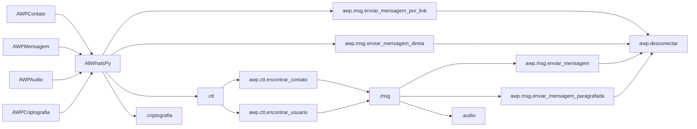

<h1 align="center">
<br>AllWhatsPy - AWP
</h1>

 
<h1 align="center">


<div align="center">
    
   
 
  
   
   
   
</div>
</h1>

> PT-BR

>Criado por [Lucas Lourenço](https://github.com/DevLucasLourenco/AllWhatsPy#autor)

>Manutenido por [Lucas Lourenço](https://github.com/DevLucasLourenco/AllWhatsPy#autor)


## Sumário <><><><><><><><><><><><><><><><><>

- [Tutorial](https://github.com/DevLucasLourenco/AllWhatsPy#tutorial-em-v%C3%ADdeo2)
- [AllWhatsPy](https://github.com/DevLucasLourenco/AllWhatsPy#por-que-allwhatspy)
- [Instalação](https://github.com/DevLucasLourenco/AllWhatsPy#come%C3%A7ando-no-allwhatspy)
- [Lista de Tarefa](https://github.com/DevLucasLourenco/AllWhatsPy#objetivos-a-serem-terminados)
- [Exemplos](https://github.com/DevLucasLourenco/AllWhatsPy#exemplos)
- [Códigos](https://github.com/DevLucasLourenco/AllWhatsPy#o-que-voc%C3%AA-pode-fazer-com-allwhatspy)
- [Notas do Criador](https://github.com/DevLucasLourenco/AllWhatsPy#notas-do-criador)
- [Autor](https://github.com/DevLucasLourenco/AllWhatsPy#autor)
- [Contribuição](https://github.com/DevLucasLourenco/AllWhatsPy#contribui%C3%A7%C3%A3o)
- [Erros](https://github.com/DevLucasLourenco/AllWhatsPy#problemas-com-o-allwhatspy)


## Tutorial em Vídeo

<h1 align="center">
 
<a href="https://youtu.be/2Z74Y_V80SA">

</a>

</h1>


## ⭐ Avalie o Código! ⭐


É de muitíssima importância a `Estrela` que você pode estar dando para colaborar com a `Manutenção` e `Atualização` do código!
Se você utiliza o AllWhatsPy com frequência, gosta da forma que foi desenvolvido, se inspira nele, serei muito grato por sua avaliação!

<h1 align="center">
<a href="https://github.com/DevLucasLourenco/AllWhatsPy/stargazers">

</a>
</h1>


## Autor

<h2>
<p>

[Linkedin](http://linkedin.com/in/lucas-lourenco0312)

</p>


<p>

[Instagram](https://www.instagram.com/lucaslourencoo__/)


</p>
 
<p>
  
Email: dev.lucaslourenco@gmail.com
  
</p>
</h2>


## Por que AllWhatsPy?

À medida que nossa dependência do WhatsApp, seja para fins profissionais ou pessoais, se torna incontestável, surge a inquietação de como otimizar essa aplicação essencial em nossas vidas. A resposta a essa inquietação se materializa na forma do AllWhatsPy, uma biblioteca inovadora e poderosa criada para revolucionar sua experiência de automação de processos no WhatsApp.

Inspirado por notáveis projetos como o [PyWhatsapp](https://github.com/shauryauppal/PyWhatsapp) e o [PyWhatKit](https://github.com/Ankit404butfound/PyWhatKit), iniciei uma jornada de exploração, imersão e pesquisa aprofundada nas possibilidades oferecidas por Bots e APIs do WhatsApp. Com um compromisso <b>`inabalável com a qualidade e o aprimoramento`</b> de software, decidi investir meu tempo e energia na criação do AllWhatsPy, um projeto que tem sido desenvolvido de forma exclusiva e independente.

Ao longo desse processo, foram dedicadas milhares de linhas de logs em testes, registrando cada passo do caminho para garantir o funcionamento perfeito da biblioteca. O resultado é uma ferramenta versátil e flexível que permite que você faça literalmente "o que quiser" no WhatsApp, proporcionando um nível inédito de eficiência e automação. O AllWhatsPy é a solução que você estava esperando para elevar a produtividade e a conveniência no uso do WhatsApp, tornando-o uma ferramenta ainda mais indispensável em sua vida.


</br>
</br>
  
## Começando no AllWhatsPy

<div align="center">
   <h2>
      INSTALAÇÃO
   </h2>
</div>

Para a instalação da lib, no terminal faça:

```
pip install -U allwhatspy-awp (<><><><><><><><><><>)
```

Após, chame o pacote. Segue um exemplo:

```python
<><><><><><><><><><><><><><><><><>
```


Você também pode estar baixando os arquivos e colar na sua pasta, caso sua máquina esteja tendo problemas em instalar esta lib.

</br>

### Lógica:




## Objetivos a Serem Terminados 

- [x] Criar alternativas para envio de mensagem (Realizado - 19/12/2022)
- [x] Tratar as `except Exception` (Realizado - 21/12/2022)
- [x] Resolver bug na urllib (Realizado - 21/12/2022)
- [x] Alimentar o código com opções alternativas para `awp.conexao()` e  `awp.desconectar()` (Realizado - 21/12/2022)
- [x] Corrigir excepts de `NoSuchElementException`  (Realizado - 22/12/2022)
- [x] Implementar WebDriverWait para melhor responsividade do software (Realizado - 27/12/2022)
- [x] Configurar a entrada de `logs` (Realizado - 28/12/2022)
- [x] Atualizar ActionChains (Realizado - 15/01/2023)
- [x] Terminar `ultimas_mensagens_conversa()` (Realizado - 18/01/2023)
- [x] Explicar todas as fórmulas (Realizado - 21/01/2023)
- [x] Aperfeiçoar a função de `agendamento` (Realizado - 21/01/2023)
- [x] Terminar o `sumário` (Realizado - 21/01/2023)
- [x] Implementar a área de `Exemplos Práticos` (Realizado - 21/01/2023)
- [x] Fazer vídeo e postar no Youtube de explicação para utilizar o código (Realizado - 22/01/2023)
- [x] Implementar exemplos convencionais (Realizado - 23/01/2023) 
- [x] Alterar Imagem da lógica do AWP com Mermaid (Realizado - 23/01/2023)
- [x] Finalizar função `encontrar_numeros_não_salvos()` (Realizado - 25/01/2023)
- [x] Implementação de Classes (Realizado - 12/02/2023)
- [x] Desenvolver um `pip install` para AWP (Realizado - 12/02/2023)
- [x] Atualizar `nome_usuario()` (Realizado - 15/02/2023)
- [x] Atualizar bug da função `desconectar()` (Realizado - 20/02/2023)
- [x] Corrigir bug na função `pegar_foto_contato()` (Realizado - 21/02/2023)
- [x] Atualizar icon do AWP (Realizado - 25/02/2023)
- [x] Atualizar `contato_nome()`
- [x] Realizar a explicação de como começar no AWP
- [ ] Performar criação de pastas com a lib `pathlib` para melhor qualidade de software
- [x] Implementação de Classes, Métodos e Módulos auxiliaers
- [x] Lançamento da Versão Final do AllWhatsPy (Realizado - 10/10/2023)


## 🚨Exemplos🚨   <><><><><><><><><><><><><><><><><><><><>

<details>
<summary>
 🚨Exemplos Práticos🚨
</summary>

<p>

 - [Exemplo Prático - Tratamento de Dados com Execução AWP](/exemplos/TratamentoDeDados-Execução.py)
 
 - [Exemplo Prático - Agendamento em Lista com Execução AWP](/exemplos/ListaDeAgendamentos-ExecucaoAWP.py)
 
 - [Exemplo Prático - Descendo Chats e Retornando as Mensagens](/exemplos/DescendoChatsBuscandoMensagens-ExecuçãoAWP.py)
</p>

</details>


<details>
<summary>
 🚨Exemplos🚨
</summary>

<p>

 - [Exemplo](/exemplos/exemplo.py)
 
 - [Exemplo]()
 
</p>

</details>


  
## O que você pode fazer com AllWhatsPy


- ##  Conectar

> É de enorme importância a utilização deste método! Afinal, ele é o responsável pela integração do AllWhatsPy ao Whatsapp.
> É possível utilizar como `awp.conexao()` . No primeiro caso, abrirá um `popup` na tela esperando a confirmação para dar continuidade.
>  No segundo caso, será ignorado o popup que aparece após a inicialização do algoritmo.

<p>
  
```python
import AllWhatsPy as awp

awp.conexao()
```
</p>


- ## Mensagens de Conversas
  
  - ### ultimas_mensagens_conversa()
    <p>
    
    > Esta função irá, na conversa atualmente aberta, pegar as mensagens que foram enviadas.0                                                                                                                                                                                                                                                                                                                                                                                                                                                                 
     Em seu início, ela subirá para ser possível de captar mais inforamções e, logo após, irá retornar tudo em um dicionário separado por índices. E os valores desses      índices serão mais um dicionário contendo todas as informações daquela conversa.
    
    ```python
    import AllWhatsPy as awp

    awp.conexao()
    awp.encontrar_contato('Lucas Lourenço')
    dados = awp.ultimas_mensagens_conversa()
    ```
     
    `output:`
    ```python
    >>> {0 : {'[09:30, 21/01/2023] Lucas Lourenço: ': 'Me encaminha oq ela disse kkkkk'}, 
    >>> 1 : {'[09:32, 21/01/2023] Jenyfer: ': ['Me encaminha oq ela disse kkkkk','taaa']},
    >>> 2 : {'[09:32, 21/01/2023] Jenyfer: ': 'você vai adorar kkkkkk'}}
 
    ```
    Como é possível reparar, será trazido informações com o índice. Os `values` deles serão outra dicionário onde você pode estar trabalhando. 
    > quando a mensagem for citando uma outra mensagem enviada pela pessoa que está conversando, o `value` desse dicionário será uma lista
  
    </p>


## Acesso ao Código
Se quiser ter acesso ao código, basta [Clicar Aqui](/AllWhatsPy/AllWhatsPy.py)


## Problemas com o AllWhatsPy
Ainda não foi encontrado problemas no código. 

Caso você tenha percebido algo, sinta-se à vontade para descrevê-lo na aba `Issues`!

E também para você que está tendo dificuldades em trabalhar com esta lib, basta descrevê-la que irei ajudá-lo!


## Contribuição

Pull Requests são muito bem vindas!

Caso seja uma grande mudança, por favor, abra uma discussão na aba `Issues` para maior compreensão do seu caso.
