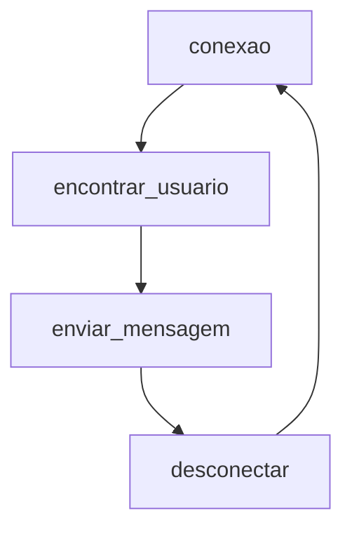

# AllWhatsPy
PT-BR | 


>Criado por Lucas Lourenço.

>Manutenido por Lucas Lourenço


## Avalie o Código!
É de muitíssima importância a `Star` que você pode estar dando para colaborar com a `Manutenção` e `Atualização` do código!
Se você utiliza o AllWhatsPy com frequência, gosta da forma que foi desenvolvido, se inspira nele, serei muito grato por sua avaliação!

Então, vamos ao que importa: `AllWhatsPy`


## Por que AllWhatsPy?
Como já sabemos, o Whatsapp é uma ferramenta que não podemos mais viver sem.
Seja para cunho profissional ou pessoal, é necessário o manuseio completo deste programa

Então... por que não torná-lo <b>`ainda mais eficiente`?</b>

Com o AllWhatsPy, [você PODE fazer o que quiser](https://github.com/LucasLourencoo/AllWhatsPy/edit/main/README.md#o-que-voc%C3%AA-pode-fazer-com-allwhatspy))

  
  
## Começando no AllWhatsPy

###Instalação


### Lógica:




## Objetivos a Serem Terminados 


  
## O que você pode fazer com AllWhatsPy

 - Conectar
 <p>
  
  ```python
import AllWhatsPy as awp
  awp.conexao()
```
</p>

- Desconectar
<p>
  
  ```python
import AllWhatsPy as awp
  awp.desconetar()
```
  
</p>

- Enviar Mensagens

  <details><summary>enviar_mensagem()</summary>
  <p>

  ```

  ```

  </p>
  </details>
  
  
  <details><summary>enviar_mensagem_paragrafada()</summary>
  <p>

  ```

  ```

  </p>
  </details>
  
  
  <details><summary>enviar_mensagem_por_link()</summary>
  <p>

  ```

  ```

  </p>
  </details>
  
  <details><summary>enviar_mensagem_direta()</summary>
  <p>

  ```

  ```

  </p>
  </details>
  
  


## Acesso ao Código
Se quiser ter acesso ao código, basta [Clicar Aqui](AllWhatsPy.py)


## Problemas com o AllWhatsPy
Ainda não foi encontrado problemas no código. 
Caso você tenha percebido algo, sinta-se à vontade para descrevê-lo na aba `Issues`!
