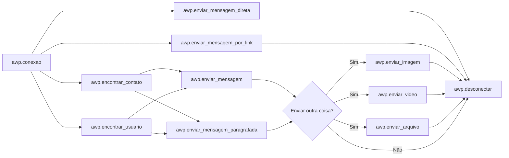

<h1 align="center">
<br>AllWhatsPy - AWP
</h1>


 
<h1 align="center">


<div align="center">
    
   
   
   
   
   
   
</div>
</h1>

> English Translation

>Created by [Lucas Lourenço](https://github.com/DevLucasLourenco/AllWhatsPy#autor)

>Maintained by [Lucas Lourenço](https://github.com/DevLucasLourenco/AllWhatsPy#autor)

<div align="center">
   <h1>ATTENTION</h1><br>
</div>

 > The code is going through a big update.<br> As time passes I will be refactoring and explaining the new functions.<br><br>
 Sincerely,<br>
 Lucas Lourenço


## Summary

- [Tutorial](https://github.com/DevLucasLourenco/AllWhatsPy#tutorial-em-v%C3%ADdeo2)
- [AllWhatsPy](https://github.com/DevLucasLourenco/AllWhatsPy#por-que-allwhatspy)
- [Installation](https://github.com/DevLucasLourenco/AllWhatsPy#come%C3%A7ando-no-allwhatspy)
- [To do list](https://github.com/DevLucasLourenco/AllWhatsPy#objetivos-a-serem-terminados)
- [Exemples](https://github.com/DevLucasLourenco/AllWhatsPy#exemplos)
- [Codes](https://github.com/DevLucasLourenco/AllWhatsPy#o-que-voc%C3%AA-pode-fazer-com-allwhatspy)
- [Creator Notes](https://github.com/DevLucasLourenco/AllWhatsPy#notas-do-criador)
- [Autor](https://github.com/DevLucasLourenco/AllWhatsPy#autor)
- [Contribuition](https://github.com/DevLucasLourenco/AllWhatsPy#contribui%C3%A7%C3%A3o)
- [Errors](https://github.com/DevLucasLourenco/AllWhatsPy#problemas-com-o-allwhatspy)


## Video Tutorial

<h1 align="center">
 
<a href="https://youtu.be/2Z74Y_V80SA">

</a>

</h1>


## ⭐ Rate the code! ⭐


It is really important the `Star` that you can be giving to help with the `Maintenance` and `Updates` of the code!
If you utilize AllWhatsPy frequently, like the way it was developed and cares about it, I will be very gratefull with your rating!

<h1 align="center">
<a href="https://github.com/DevLucasLourenco/AllWhatsPy/stargazers">

</a>
</h1>


## Why AllWhatsPy?

As we know, Whatsapp is a tool that we can no longer live without.
Be for professional or private use, it is necessary the full control of this aplication.

So... Why not make it <b>`even more efficient`?</b>

After thinking about it, I started to search about Bots ans APIs for Whatsapp, I got inspired by codes like the ones from [PyWhatsapp](https://github.com/shauryauppal/PyWhatsapp) and [PyWhatKit](https://github.com/Ankit404butfound/PyWhatKit) for making this one.

Posterior to a time studying and switching between work and the software, I've put my hands at work and started my journey looking for the upgrade and quality of the Software. I'm still updanting and developing, doing this all by myself.

More than Foram usadas mais de [11 thousand log lines](https://github.com/DevLucasLourenco/AllWhatsPy/edit/main/README.md#-3) were used for the full funtioning of the code.

With AllWhatsPy, you can do [whatever you want!](https://github.com/DevLucasLourenco/AllWhatsPy/edit/main/README.md#o-que-voc%C3%AA-pode-fazer-com-allwhatspy)


</br>
</br>
  
## Starting in AllWhatsPy

<div align="center">
   <h2>
      INSTTALLING
   </h2>
</div>

To install the lib, in the terminal do:

```
pip install -U allwhatspy-awp
```

Afterwards, call the package. Here's an example: Após, chame o pacote. Segue um exemplo:

```python
import AllWhatsPy as awp
```


You can also download the files then paste it on your folder, if your machine is having problems installing the lib.

</br>

### Logic:




## Unfinished Objectives 

- [x] Create alternatives for message sending (Done - 19/12/2022)
- [x] Fix the `except Exception` (Done - 21/12/2022)
- [x] Bug Fixing on urllib (Realizado - 21/12/2022)
- [x] Feeding the code with alternatives for `awp.conexao()` e  `awp.desconectar()` (Done - 21/12/2022)
- [x] Fix `NoSuchElementException` excepts (Done - 22/12/2022)
- [x] Implement WebDriverWait for better software responsiveness (Done - 27/12/2022)
- [x] Configure `logs` input (Done - 28/12/2022)
- [x] Update ActionChains (Done - 15/01/2023)
- [x] Finish `ultimas_mensagens_conversa`() (Done - 18/01/2023)
- [x] Explain all formulas (Done - 21/01/2023)
- [x] Improve `agendamento` function (Done - 21/01/2023)
- [x] Finish the `summary` (Done - 21/01/2023)
- [x] Implement the section of `Practical Examples` (Done - 21/01/2023)
- [x] Create a video and post it on Youtube to explain how to use the code (Done - 22/01/2023)
- [x] Implement conventional examples (Done - 23/01/2023) 
- [x] Change AWP logic image with Mermaid (Done - 23/01/2023)
- [x] Finalize `encontrar_numeros_não_salvos()` function (Done - 25/01/2023)
- [x] Class implementation (Done - 12/02/2023)
- [x] Develop a `pip install` for AWP (Done - 12/02/2023) 
- [x] Update nome_usuario() (Done - 15/02/2023)
- [x] Update bug in the desconectar() function (Done - 20/02/2023)
- [x] Fix bug in the pegar_foto_contato() function (Done - 21/02/2023)
- [x] Update AWP icon (Done - 25/02/2023)
- [ ] Update contato_nome()
- [ ] Provide an explanation on how to get started with AWP
- [ ] Implement folder creation using the pathlib library for better software quality
- [ ] Complete the buscar_contatos_não_lidos() function
- [ ] Complete the retornar_posicao_anterior() function
- [ ] Implementation of Classes, Methods, and Auxiliary Modules


## 🚨Examples🚨

<details>
<summary>
 🚨Practical Examples🚨
</summary>

<p>

 - [Exemplo Prático - Tratamento de Dados com Execução AWP](/exemplos/TratamentoDeDados-Execução.py)
 
 - [Exemplo Prático - Agendamento em Lista com Execução AWP](/exemplos/ListaDeAgendamentos-ExecucaoAWP.py)
 
 - [Exemplo Prático - Descendo Chats e Retornando as Mensagens](/exemplos/DescendoChatsBuscandoMensagens-ExecuçãoAWP.py)
</p>

</details>


<details>
<summary>
 🚨Examples🚨
</summary>

<p>

 - [Exemplo](/exemplos/exemplo.py)
 
 - [Exemplo]()
 
</p>

</details>


  
## What can you do with AllWhatsPy


- ## Connect

> The usage of this code is of great importance! After all, it is responsible for integrating AllWhatsPy with WhatsApp.
> You can use it as awp.conexao() or awp.conexao(2). In the first case, it will open a popup on the screen waiting for confirmation to proceed.
> In the second case, the popup that appears after the algorithm's initialization will be ignored.

<p>
  
```python
import AllWhatsPy as awp

awp.conexao()
```
</p>


ou


<p>
  
```python
import AllWhatsPy as awp

awp.conexao(2)
```
</p>


- ## Disconnect

> After completing all the functions you have used, if you wish to disconnect WhatsApp, run this code. Otherwise, your login will always be registered as 'still connected,' even if you close the window.
> You can use it as `awp.desconectar()` or `awp.desconectar(2)`. In the first case, the software will terminate and close the window. In the second case, it will keep the QR Code window open.
<p>
  
  ```python
import AllWhatsPy as awp


awp.conexao()
awp.desconetar()
```  
</p>

- ## Working with Chats/Contacts/Users

  - ### encontrar_contato(contato)
  <p>
  
    > With this function, we will open conversations to proceed with the remaining codes. It will search by the name or by the number, as long as it is already saved.
    

  ```python
  import AllWhatsPy as awp
    
  awp.conexao()
  awp.encontrar_contato('Lucas Lourenço')
   
  awp.desconectar()
  ```

  </p>

  - ### encontrar_usuario(numero)
  <p>
  
    > With this function, we can search only by the number and not by the name. However, you do NOT need to have the number saved. It can be useful for sending messages to lists of numbers and similar scenarios.
    

  ```python
  import AllWhatsPy as awp

    
  awp.conexao()
  awp.encontrar_usuario('21900000000')
   
  awp.desconectar()
  ```

  
  </p>

  - ### encontrar_primeira_conversa(ignorar_fixado = True)
  <p>
  
    > This function will be responsible for opening the first conversation in your WhatsApp.
If `ignorar_fixado` is set to True, it will check if there is a pinned conversation and skip it.
If the value of `ignorar_fixado` is False, it will select the first pinned conversation.
    

  ```python
  import AllWhatsPy as awp
    
  awp.conexao()
  awp.encontrar_primeira_conversa()
   
  awp.desconectar()
  ```

  
  </p>
  
  
  - ### descer_conversa_origem_atual(quantidade: int = 1)
  <p>
  
    > This function will scroll down the currently open conversation.
As an argument, you can indicate how many times you want to scroll down. By default, it is set to 1. 
    

  ```python
  import AllWhatsPy as awp
    
  awp.conexao()
  awp.encontrar_contato('Lucas Lourenço')
  awp.descer_conversa_origem_atual()
   
  awp.desconectar()
  ```

  </p>  
  
  
  - ### subir_conversa_origem_atual(quantidade: int = 1)
  <p>
  
    > This function will scroll up the currently open conversation.
As an argument, you can indicate how many times you want to scroll up. By default, it is set to 1. 
    

  ```python
  import AllWhatsPy as awp
    
  awp.conexao()
  awp.encontrar_contato('Lucas Lourenço')
  awp.subir_conversa_origem_atual()
   
  awp.desconectar()
  ```

  </p> 


  - ### descer_chat_quantidade(quantidade: int)
  <p>
  
    > This function will scroll down the currently open conversation according to the declared quantity.
     

  ```python
  import AllWhatsPy as awp
    
  awp.conexao()
  awp.descer_chat_quantidade()
   
  awp.desconectar()
  ```

  </p> 


  - ### sair_da_conversa()
  <p>
  
    > Function responsible for exiting the currently open conversation.
     

  ```python
  import AllWhatsPy as awp
    
  awp.conexao()
  awp.encontrar_usuario(21900000000)
  awp.enviar_mensagem('Olá!')
  awp.sair_da_conversa()
  
  ```

  </p> 


  - ### aplicar_filtro()
  <p>
  
    > Function responsible for applying the filter, showing only the messages that have not been read.
     

  ```python
  import AllWhatsPy as awp
    
  awp.conexao()
  awp.aplicar_filtro()
   
  awp.desconectar()
  ```

  </p> 


  - ### pegar_dados_contato()
  <p>
  
    > This function will return a list containing the name and the number of the contact that is currently open.
Where index 0 represents the name and index 1 represents the number.
     

  ```python
  import AllWhatsPy as awp
  
    
  awp.conexao()
  dados = awp.pegar_dados_contato()
  
  ```

  </p>


  - ### apagar_conversa()
  <p>
  
    > Through this function, the currently open conversation will be deleted.
     

  ```python
  import AllWhatsPy as awp
    
  awp.conexao()
  awp.encontrar_contato('Lucas Lourenço')
  awp.apagar_conversa()
  
  awp.desconectar()
  
  ```

  </p>
  
  
  - ### arquivar_conversa()
  <p>
  
    > Through this function, the currently open conversation will be archived.
     

  ```python
  import AllWhatsPy as awp
  
    
  awp.conexao()
  awp.encontrar_contato('Lucas Lourenço')
  awp.arquivar_conversa()
  
  awp.desconectar()
  
  ```

  </p>
  
  
  - ### marcar_como_nao_lida()
  <p>
  
    > Through this function, the currently open conversation will be marked as unread.
     

  ```python
  import AllWhatsPy as awp
    
  awp.conexao()
  awp.encontrar_contato('Lucas Lourenço')
  awp.marcar_como_nao_lida()
  
  awp.desconectar()
  
  ```

  </p>
  
  
  - ### nome_usuario()
  <p>
  
    > This function returns the user's name.
  
    ```python
  import AllWhatsPy as awp
    
  awp.conexao()
  nome = awp.nome_usuario()
  awp.enviar_mensagem(f'Olá! eu sou o {nome}')
  
  awp.desconectar()
  
  ```
  
  
- ## Enviando Mensagens

  - ### enviar_mensagem(mensagem)
  <p>
  
  > Function responsible for sending messages. This specific function will send messages one after the other, depending on the data provided. If you input a list containing all the messages you want to send, it will send them one by one. Each item in this list will be a different message. If you input numbers and strings, it will also understand. It is the most commonly used among the 4 message sending functions due to its simplicity of use.
  
  
  ```python
  import AllWhatsPy as awp

  awp.conexao()
  awp.encontrar_contato('Lucas Lourenço')
  awp.enviar_mensagem('Hello World!')

  awp.desconectar()
  
  ```

  </p>


  - ### enviar_mensagem_paragrafada(mensagem)
  <p>

  > 
Unlike "enviar_mensagem()", this function will not send messages one after the other. If the string contains more than one line, the function will analyze and combine everything into a single line, thus sending not several messages one after the other but rather a single one.
  
  
  ```python
  import AllWhatsPy as awp

  awp.conexao()
  awp.encontrar_contato('Lucas Lourenço')
  awp.enviar_mensagem_paragrafada(
  '''
  Olá!
  Meu nome é Lucas Lourenco.
  Sou o Criador do AWP.
  '''
  )

  awp.desconectar()
  ```

  </p>


  - ### enviar_mensagem_por_link(numero, mensagem)
    <p>
  
  > This function will take a feature of WhatsApp and use it to send messages through it!
There is no need to use "encontrar_usuario()" or "encontrar_contato()".
Note: Do not use this function to send messages to many people, as it may lead to your number being blocked.
  
    ```python
  import AllWhatsPy as awp

  awp.conexao()
  awp.enviar_mensagem_por_link(21900000000 ,'E ai, tudo bem?')

  awp.desconectar()

    ```

    </p>


   - ### enviar_mensagem_direta(contato, mensagem, selecionar_funcao, salvo):

  <p>
  
  > This function will eliminate the need for performing the entire process that would have been required with the other functions. Everything will be handled by this single function.
  
  >contato = The destination of the message, whether it is a number or name.
  
  >mensagem = The message that will be sent to the contact.
  
  >selecionar_função = Between 1 and 2, will be the functions enviar_mensagem(), enviar_mensagem_paragrafada() respectively.
  
  >salvo = If True, the contact must be saved; hence, the argument "contato" should be a number that is already saved in your WhatsApp.

Otherwise, if False, it will use the method by link, for which the argument "contato" should be a number.
  
  For saved numbers:
  
    ```python
    
  import AllWhatsPy as awp

  awp.conexao()
  awp.enviar_mensagem_direta('Lucas Lourenco','Olá! Tudo bem?',1 ,True)

  awp.desconectar()
    ```

 
    
  For non saved numbers:
  
  ```python

  import AllWhatsPy as awp

  awp.conexao()
  awp.enviar_mensagem_direta(21900000000,'Olá! Tudo bem?',1 ,False)

  awp.desconectar()
  ```

  </p>
  
  
  
- ## Go back to the last contact you stopped at
<p>
  
  > First, use the following code to register it. 
  
  
```python
import AllWhatsPy as awp
  
awp.conexao()
awp.contato_registrar()
  
awp.desconectar()
```
 > After having registered, use the following to go back to the contact.
There are 2 options. If the declared value is 1, it will search by the contact's name. If the declared value is 2, it will search by the number.

(Even if the machine is turned off, the data is still saved. Just run the code below)
  
```python
import AllWhatsPy as awp
  
awp.conexao()
awp.contato_abrir_registrado(2)
  
awp.desconectar()
```
</p>


- ## Scheduling
<p>
  
> The code will wait until the scheduled time arrives. After that, it will proceed and allow the rest of the code to continue.

`awp.agendamento(dia_programado, hora_programado, minuto_programado)`

```python
import AllWhatsPy as awp

  
awp.conexao()
awp.agendamento('20', '08', '30')
awp.encontrar_contato('Lucas Lourenço')
awp.enviar_mensagem('Hello World')
  
awp.desconectar()
```
</p>

- ## Sending Arquives, Videos and Images

  - ### enviar_imagem(nome_imagem)
    <p>

    > This function is responsible for sending images.
The image needs to be in the same folder as the main module, or you can pass the path to the image as an argument.


    ```python
    import AllWhatsPy as awp

    awp.conexao()
    awp.encontrar_contato('Lucas Lourenço')
    awp.enviar_imagem('AlgumaImagem.png')

    awp.desconectar()
    ```

    </p>


  - ### enviar_video(nome_video)
    <p>

    > This function is responsible for sending videos.
The video needs to be in the same folder as the main module, or you can pass the path to the video as an argument.
    
    > The function will check if the file is smaller than the maximum video size limit for sending on WhatsApp


    ```python
    import AllWhatsPy as awp
    

    awp.conexao()
    awp.encontrar_contato('Lucas Lourenço')
    awp.enviar_video('nome_video.mp4')

    awp.desconectar()
    ```

    </p>


  - ### enviar_arquivo(nome_arquivo)
    <p>

    > This function is responsible for sending files.
The file needs to be in the same folder as the main module, or you can pass the path to the file as an argument.
    

    ```python
    import AllWhatsPy as awp

    awp.conexao()
    awp.encontrar_contato('Lucas Lourenço')
    awp.enviar_arquivo('nome_arquivo.ext')

    awp.desconectar()
    ```

    </p>


- ## Listing the Last Messages and Related Contacts
  
  - ### lista_ultimas_mensagens_recebidas_de_contatos(quantidade: int = 1)
    <p>
    
    > Function responsible for finding the latest messages sent by each contact
     according to the quantity provided in the function's application.
    By default, the quantity is 1, but you can change it, and it will return as many conversations as predetermined.
    This function will return a dictionary containing 2 pieces of data, which are:
    
    >1- Key - Contacts's name
    
    >2- Values: tupla - At index 0, you will find the time the last message was sent, and at index 1, you will find the last message.
    
    
    ```python
    import AllWhatsPy as awp

    awp.conexao()
    dados = awp.lista_ultimas_mensagens_recebidas_de_contatos()

    ```
    
    </p>


- ## Conversation Messages
  
  - ### ultimas_mensagens_conversa()
    <p>
    
    > This function will go in the currently open conversation and pick up the messages that have been sent.0                                                                                                                                                                                                                                                                                                                                                                                                                                                               
     At the beginning, it will go up to be able to capture more information and, soon after, it will return everything in a dictionary separated by indexes. And the values of these indexes will be another dictionary containing all the information of that conversation.
    
    ```python
    import AllWhatsPy as awp

    awp.conexao()
    awp.encontrar_contato('Lucas Lourenço')
    dados = awp.ultimas_mensagens_conversa()
    ```
     
    `output:`
    ```python
    >>> {0 : {'[09:30, 21/01/2023] Lucas Lourenço: ': 'Send me what she said kkkkk'}, 
    >>> 1 : {'[09:32, 21/01/2023] Jenyfer: ': ['Send me what she said kkkkk','okaay']},
    >>> 2 : {'[09:32, 21/01/2023] Jenyfer: ': 'you will love it kkkkkk'}}
 
    ```
    As it is possible to repair, information will be brought with the index. Their `values` will be another dictionary you might be working on. 
    > when the message is quoting another message sent by the person who is chatting, the `value` of this dictionary will be a list
  
    </p>


## Code Access
If you want access to the code, just [Click Here](/AllWhatsPy/AllWhatsPy.py)


## Creator notes

For the creation of this code, more than 11 thousand lines of log were used
<h1 align="center">

</h1>

> The first time you run the code, a log file will be created. There, will be all the necessary events for your information.


## Autor

<h2>
<p>

[Linkedin](http://linkedin.com/in/lucas-lourenco0312)

</p>


<p>

[Instagram](https://www.instagram.com/lucaslourencoo__/)


</p>
 
<p>
  
Email: dev.lucaslourenco@gmail.com
  
</p>
</h2>


## Problems with AllWhatsPy
No problems have been found in the code yet.

If you noticed something, feel free to describe it in the `Issues` tab!

And also for you who are having difficulties working with this lib, just describe it and I will help you!


## Contribution

Pull Requests are very welcome!

If it is a big change, please open a discussion on the `Issues` tab for further understanding of your case.

