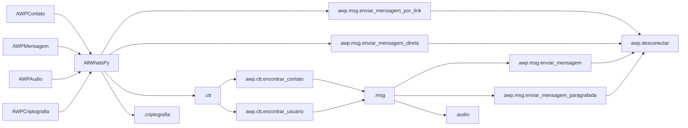
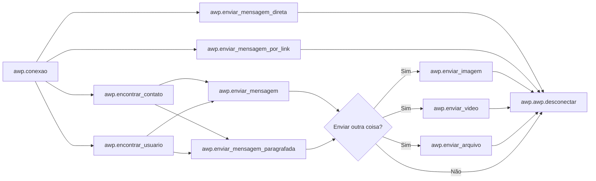

```mermaid
flowchart LR
  AWPContato  --> AllWhatsPy
  AWPMensagem --> AllWhatsPy
  AWPAudio --> AllWhatsPy
  AWPCriptografia --> AllWhatsPy

  AllWhatsPy ----> awp.msg.enviar_mensagem_por_link 
  AllWhatsPy ----> awp.msg.enviar_mensagem_direta

  awp.msg.enviar_mensagem_por_link ----> awp.desconectar
  awp.msg.enviar_mensagem_direta ----> awp.desconectar

  AllWhatsPy ---> .ctt
  AllWhatsPy --> .criptografia 
  
  .ctt --> awp.ctt.encontrar_contato
  .ctt --> awp.ctt.encontrar_usuario
  
  awp.ctt.encontrar_contato --> .msg
  awp.ctt.encontrar_usuario --> .msg


  .msg ---> awp.msg.enviar_mensagem
  .msg ---> awp.msg.enviar_mensagem_paragrafada

  .msg --> .audio 

  awp.msg.enviar_mensagem_paragrafada --> awp.desconectar
  awp.msg.enviar_mensagem --> awp.desconectar


```

```mermaid
flowchart LR;
    awp.conexao-->awpe[awp.encontrar_contato];
    awp.conexao-->awpu[awp.encontrar_usuario];
    awp.conexao---->awp.enviar_mensagem_por_link;
    awp.conexao---->awp.enviar_mensagem_direta;
        
    
    awpe-->awp.enviar_mensagem;
    awpe-->awp.enviar_mensagem_paragrafada;
    
    awpu-->awp.enviar_mensagem;
    awpu-->awp.enviar_mensagem_paragrafada;
    
    awp.enviar_mensagem-->E{Enviar outra coisa?};
    awp.enviar_mensagem_paragrafada-->E;
    awp.enviar_mensagem_direta---->d[awp.awp.desconectar];
    awp.enviar_mensagem_por_link---->d;
    
    
    
    E -- Sim --> awp.enviar_imagem;
    E -- Sim --> awp.enviar_video;
    E -- Sim --> awp.enviar_arquivo;
    
    
    awp.enviar_imagem --> d;
    awp.enviar_video --> d;
    awp.enviar_arquivo --> d;
    E -- Não --> d;
       
```
