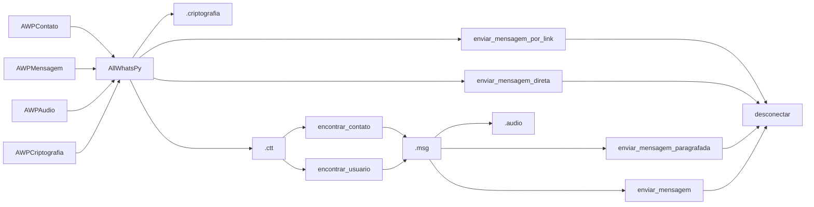
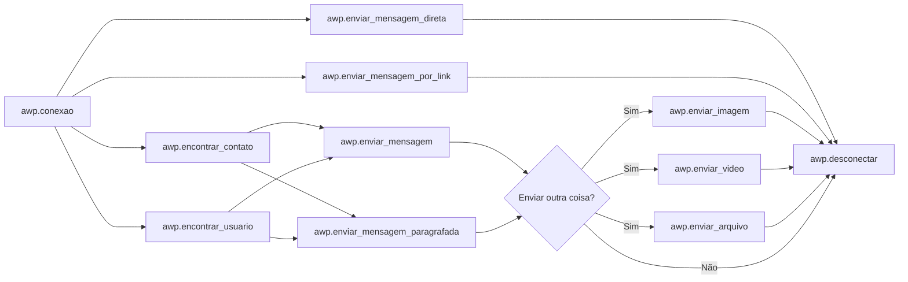

```mermaid
flowchart LR
  AWPContato  --> AllWhatsPy
  AWPMensagem --> AllWhatsPy
  AWPAudio --> AllWhatsPy
  AWPCriptografia --> AllWhatsPy

  AllWhatsPy ----> enviar_mensagem_por_link 
  AllWhatsPy ----> enviar_mensagem_direta

  enviar_mensagem_por_link ----> desconectar
  enviar_mensagem_direta ----> desconectar

  AllWhatsPy ---> .ctt
  AllWhatsPy --> .criptografia
  
  .ctt --> encontrar_contato
  .ctt --> encontrar_usuario
  
  encontrar_contato --> .msg
  encontrar_usuario --> .msg

  .msg --> .audio

  .msg ----> enviar_mensagem
  .msg ----> enviar_mensagem_paragrafada

  enviar_mensagem_paragrafada --> desconectar
  enviar_mensagem --> desconectar


```

```mermaid
flowchart LR;
    awp.conexao-->awpe[awp.encontrar_contato];
    awp.conexao-->awpu[awp.encontrar_usuario];
    awp.conexao---->awp.enviar_mensagem_por_link;
    awp.conexao---->awp.enviar_mensagem_direta;
        
    
    awpe-->awp.enviar_mensagem;
    awpe-->awp.enviar_mensagem_paragrafada;
    
    awpu-->awp.enviar_mensagem;
    awpu-->awp.enviar_mensagem_paragrafada;
    
    awp.enviar_mensagem-->E{Enviar outra coisa?};
    awp.enviar_mensagem_paragrafada-->E;
    awp.enviar_mensagem_direta---->d[awp.desconectar];
    awp.enviar_mensagem_por_link---->d;
    
    
    
    E -- Sim --> awp.enviar_imagem;
    E -- Sim --> awp.enviar_video;
    E -- Sim --> awp.enviar_arquivo;
    
    
    awp.enviar_imagem --> d;
    awp.enviar_video --> d;
    awp.enviar_arquivo --> d;
    E -- Não --> d;
       
```
